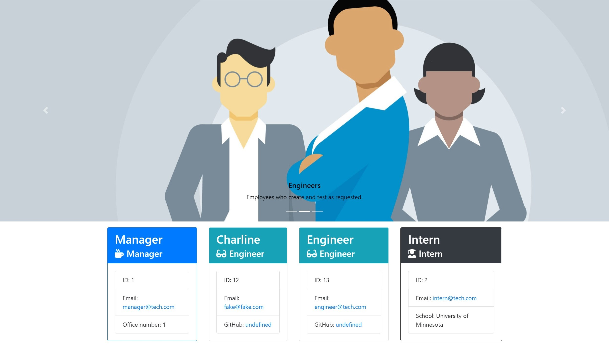

# Employee Summary Testing

The purpose of this project is to aid existing code and aid with testing successfully. This included writing code in JavaScript for the code to gather data and write in HTML for an appealing UI.

**Created On**: `2020 October 20`
 
Repository: https://github.com/charlinelach/employeeSummary

## Table of Contents
* [Usage](#usage)
* [Installation](#installation)
* [Credits & Thank You](#credits)
* [Testing](#testing)
* [License](#license)

# Development

## Usage Instructions
To utilize the application, the user would need to utilize Node.js, JSON, npm, and potientially more (depends on what already exists on the device).
 
Once the device has this application in place, testing may begin with "node app". That line in the Terminal will bring up questions for the user to answer about employees. Once the questions are completely filled out (if successfully), a UI is created in an output folder.
  
[Video Example of the Test](https://youtu.be/mNhw_us14Iw)

## Installation
Keep an eye out for:  
* Node.js
* JSON

## Credits
Shout out to the wonderful instructor, TAs, and classmates!
 
Lots of work done in the Develop piece of this assignment. Definitely allowed for a good use of time!

## Testing
Testing was the purpose of this project. Testing was done to see that employees may be added to a team.

# License
MIT License  
Copyright (c) 2020
